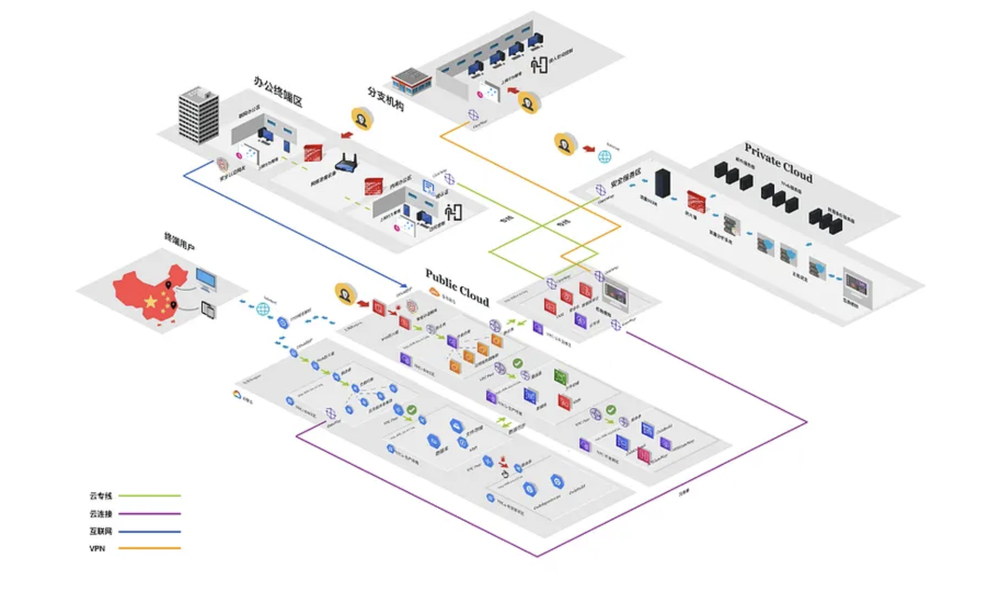

# CyberDiagram Landing Page

A professional, clean landing page for the CyberDiagram AI-powered cloud security platform.

## Quick Start

1. Open `index.html` in your web browser
2. Or serve with a local server:
   ```bash
   python3 -m http.server 8000
   # Visit http://localhost:8000
   ```

## Customization Guide

### 1. Update Founder Profile

**Add Your Profile Image:**
1. Place your profile photo in the `mockup` folder
2. Name it `founder-profile.jpg` (or update the filename in line 942 of `index.html`)
3. Recommended size: 400x400px or larger, square aspect ratio

**Update LinkedIn Link:**
1. Find line 949 in `index.html`
2. Replace `https://www.linkedin.com/in/your-profile` with your actual LinkedIn profile URL

**Update Founder Name:**
1. Find line 947 in `index.html`
2. Replace `Your Name` with your actual name

Example:
```html
<h3 class="founder-name">Leo Zhao</h3>
<p class="founder-title">Founder & CEO | Cloud Security Expert</p>
<a href="https://www.linkedin.com/in/leozhao-security" target="_blank" ...>
```

### 2. Replace Attack Path Visualization

The visual placeholder (large dashed box) is ready for your attack path diagram:

1. Update line 820 in `index.html`
2. Replace the placeholder content with:
   ```html
   
   ```

### 3. Customize Colors

Main brand colors are defined in the CSS. Search and replace to customize:

- **Primary Blue**: `#2563EB` → Your brand color
- **Dark Blue**: `#1E40AF` → Darker shade
- **LinkedIn Blue**: `#0A66C2` (standard LinkedIn color)

### 4. Update Contact Information

**Email for Early Access:**
- Find the "Request Early Access" buttons
- Update the `href="#"` to `href="mailto:your-email@cyberdiagram.com"`

**Add Contact Email to Footer:**
- Navigate to the footer section (around line 1025)
- Add your contact information

### 5. Add Real Functionality

**Email Capture:**
- Replace CTA buttons with a form:
  ```html
  <form action="https://your-email-service.com/submit" method="POST">
      <input type="email" placeholder="Enter your email" required>
      <button type="submit" class="btn btn-primary">Request Early Access</button>
  </form>
  ```

**Analytics:**
- Add Google Analytics or other tracking in the `<head>` section

## File Structure

```
mockup/
├── index.html              # Main landing page
├── attack.png             # Attack path visualization reference
├── founder-profile.jpg    # Your profile photo (add this)
├── marketing_materials.md # Source content
├── quick_pitch_materials.md
├── development_roadmap.md
└── README.md              # This file
```

## Features

### Design
- ✅ Clean, minimalist white aesthetic
- ✅ Professional blue color scheme (#2563EB)
- ✅ Fully responsive (mobile, tablet, desktop)
- ✅ Smooth animations and hover effects

### Sections
- ✅ Fixed navigation with 3 tabs
- ✅ Hero section with dual CTAs
- ✅ Visual placeholder for attack diagram
- ✅ Problem statement (3 pain points)
- ✅ Solution overview (3 features)
- ✅ How it works (4 steps)
- ✅ Founder credibility with profile & LinkedIn
- ✅ Final CTA
- ✅ Professional footer

### Interactive Elements
- ✅ Navbar scroll effects
- ✅ Smooth scrolling to sections
- ✅ Active section highlighting
- ✅ Card hover effects
- ✅ Button animations

## Browser Support

- Chrome (latest)
- Firefox (latest)
- Safari (latest)
- Edge (latest)
- Mobile browsers (iOS Safari, Chrome Mobile)

## Deployment

### GitHub Pages
1. Push to GitHub repository
2. Go to Settings → Pages
3. Select source branch (main)
4. Your site will be live at `https://yourusername.github.io/repository-name/mockup/`

### Netlify
1. Drag and drop the `mockup` folder to Netlify
2. Your site will be live instantly with a custom URL

### Custom Domain
1. Add your domain to hosting provider
2. Update DNS records
3. Enable HTTPS via hosting provider

## Next Steps

1. ✅ Add your profile photo (`founder-profile.jpg`)
2. ✅ Update LinkedIn URL and founder name
3. ✅ Replace visual placeholder with actual attack path diagram
4. Add email capture functionality
5. Connect to backend/CRM for lead collection
6. Add Google Analytics tracking
7. Create additional pages (Product, About)
8. Add testimonials section (future)
9. Integrate with email service (Mailchimp, SendGrid)
10. Set up A/B testing for CTAs

## Support

For questions or issues, refer to:
- [SYSTEM_ARCHITECTURE.md](../SYSTEM_ARCHITECTURE.md) - Complete system design
- [API_DESIGN.md](../API_DESIGN.md) - API specifications
- [PROJECT_CONTEXT.md](../PROJECT_CONTEXT.md) - Full project context

---

**CyberDiagram** - Making enterprise-grade cloud security accessible to every business.
